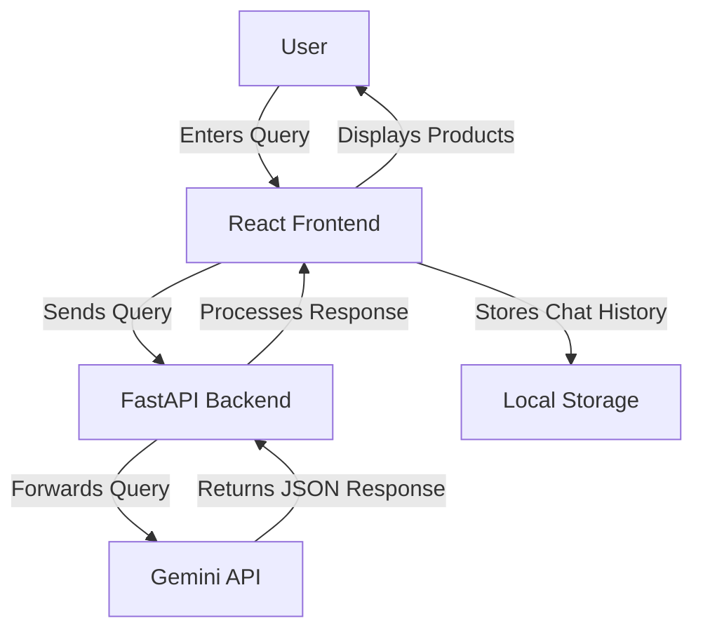

# Design Document: AI-Powered Shopping Assistant

## Overview

The AI-Powered Shopping Assistant is a web application that enables Indian users to search for products using natural language queries. The system leverages the Gemini API to process these queries and extract structured product information, which is then presented to the user in a comparison format with affiliate links.

This design document outlines the architecture, components, data models, and implementation strategy for building this application as a one-day MVP using React for the frontend and FastAPI for the backend. The UI/UX design follows a responsive approach using SHADCN UI components and Tailwind CSS for styling.

## Architecture

The application follows a client-server architecture with the following components:

1. **Frontend (React)**: Handles user interface, query input, and product comparison display
2. **Backend (FastAPI)**: Manages API requests, communicates with the Gemini API, and processes responses
3. **External Services**: Gemini API for natural language processing and product recommendations

### High-Level Architecture Diagram



## Components and Interfaces

### 1. Frontend Components (React)

#### 1.1 Chat Interface
- **ChatInput**: Text input component for user queries
- **ExampleQueries**: Component displaying example queries
- **ChatHistory**: Component for displaying conversation history (optional)
- **LoadingIndicator**: Visual feedback during API calls

#### 1.2 Product Comparison Components
- **ProductComparisonContainer**: Parent component for product comparison
- **ProductCard**: Component for displaying individual product details
- **FeatureList**: Component for displaying product features
- **ProsCons**: Component for displaying pros and cons
- **BuyButton**: Component for affiliate link with tracking

#### 1.3 State Management
- React's Context API or Redux for state management
- Local storage for chat history persistence
- Conversation context management to maintain query context between messages

### 2. Backend Components (FastAPI)

#### 2.1 API Endpoints
- **/api/query**: Endpoint for processing user queries
  - Input: User query string and conversation history
  - Output: Structured JSON response with product recommendations

#### 2.2 Services
- **GeminiService**: Service for communicating with Gemini API
- **ProductParserService**: Service for parsing and validating Gemini API responses
- **AffiliateService**: Service for generating affiliate links
- **ContextManagerService**: Service for managing conversation context and extracting relevant information from previous queries

### 3. External Interfaces

#### 3.1 Gemini API
- Integration with Gemini API for natural language processing
- System prompt to guide response format (JSON only)

## Data Models

### 1. User Query
```typescript
interface UserQuery {
  text: string;
  timestamp: Date;
}
```

### 2. Chat Message
```typescript
interface ChatMessage {
  id: string;
  text: string;
  sender: 'user' | 'system';
  timestamp: Date;
  products?: Product[]; // For system messages that contain product recommendations
}

interface ConversationContext {
  messages: ChatMessage[];
  lastQuery?: string;
  lastProductCriteria?: {
    category?: string;
    priceRange?: {min?: number; max?: number};
    features?: string[];
    brand?: string;
    marketplace?: string;
  };
}
```

### 3. Product
```typescript
interface Product {
  title: string;
  price: number;
  rating: number;
  features: string[];
  pros: string[];
  cons: string[];
  link: string;
}
```

### 4. API Response (Generated by LLM Chat Model)
```typescript
interface ApiResponse {
  query: string;
  products: Product[]; // Product recommendations generated by the LLM chat model
  recommendationsSummary: string; // Summary of best product and deals based on the list of products
  error?: string;
}
```

## Error Handling

### 1. Frontend Error Handling
- Input validation for user queries
- Error states for API failures
- Fallback UI for parsing errors
- Retry mechanism for failed requests

### 2. Backend Error Handling
- Request validation using Pydantic models
- Exception handling for Gemini API errors
- Logging for debugging and monitoring
- Appropriate HTTP status codes for different error scenarios

### 3. Common Error Scenarios
- Gemini API unavailable or rate limited
- Malformed JSON response from Gemini API
- Network connectivity issues
- Invalid user queries

## Testing Strategy

### 1. Frontend Testing
- Unit tests for React components using Jest and React Testing Library
- Integration tests for user flows
- Responsive design testing across different device sizes

### 2. Backend Testing
- Unit tests for API endpoints using pytest
- Integration tests for Gemini API communication
- Mock tests for external dependencies

### 3. End-to-End Testing
- Manual testing of the complete user flow
- Performance testing for response times

## Implementation Details

### 1. Frontend Implementation

#### 1.1 Project Setup
- Create React App or Vite for project initialization
- Setup ESLint and Prettier for code quality
- Configure environment variables for API endpoints

#### 1.2 UI Framework
- Use a lightweight UI framework like Tailwind CSS for styling
- Implement responsive design for mobile and desktop

#### 1.3 API Communication
- Use Axios or Fetch API for backend communication
- Implement request/response interceptors for error handling

### 2. Backend Implementation

#### 2.1 Project Setup
- FastAPI application structure
- Dependency injection for services
- Environment variable configuration

#### 2.2 Gemini API Integration
- System prompt engineering for structured responses
- Error handling and retry logic
- Response validation and parsing

#### 2.3 Affiliate Link Generation
- Dynamic affiliate tag insertion
- URL validation and formatting

### 3. Deployment Strategy

#### 3.1 Frontend Deployment
- Build optimization for production
- Deployment to Vercel

#### 3.2 Backend Deployment
- Containerization using Docker
- Deployment to a suitable platform (e.g., Heroku, Railway, or Fly.io)

#### 3.3 Environment Configuration
- Secure storage of API keys
- Configuration of CORS settings

## Design Decisions and Rationales

### 1. Technology Stack
- **React**: Chosen for its component-based architecture and large ecosystem, making it ideal for rapid development of interactive UIs.
- **FastAPI**: Selected for its speed, async support, and automatic API documentation, which accelerates backend development.
- **Gemini API**: Preferred for its natural language understanding capabilities and ability to generate structured responses.

### 2. Architecture Decisions
- **Separation of Frontend and Backend**: Allows for independent scaling and development of each component.
- **JSON-based Communication**: Standardizes data exchange between all system components.
- **Local Storage for Chat History**: Provides persistence without requiring a database setup, suitable for an MVP.

### 3. UI/UX Decisions
- **Card-based Product Comparison**: Provides a clean, visual way to compare products side by side.
- **Example Queries**: Helps users understand the capabilities of the system and provides guidance.
- **Loading Indicators**: Provides feedback during API calls to improve user experience.

## Conversation Context Management

### 1. Context Tracking Strategy
- Track key product criteria mentioned in previous messages (price range, features, brands, etc.)
- Maintain a structured representation of the conversation context
- Use this context to enhance follow-up queries

### 2. Context Integration with Gemini API
- Include relevant conversation history when sending queries to Gemini API
- Structure the prompt to emphasize maintaining context between queries
- Example: When user asks "What about under ₹20k?" after previously asking about "5G phones with 8GB RAM", the system should understand this as "5G phones with 8GB RAM under ₹20k"

### 3. Context Extraction
- Extract key product criteria from each user query and AI response
- Build a cumulative understanding of user requirements
- Use this understanding to enhance subsequent queries

## Frontend UI/UX Architecture

### Page Layout Structure

The application follows a structured layout with distinct sections for different functionalities:

```plaintext
+----------------------------------------------------------------------------------+
|                                   Header (Top)                                   |
+---------------------------+------------------------------------+---------------+
|      Left Section         |            Right Section           |               |
|---------------------------|------------------------------------|               |
| - Chat interface          | - Product comparison matrix        |               |
| - Chat input              | - Product cards                    |               |
| - Chat history            | - Marketing message (if no results)|               |
| (as part of conversation) |                                    |               |
+---------------------------+------------------------------------+---------------+
|                                   Footer                                        |
+----------------------------------------------------------------------------------+
```

### SHADCN + Tailwind CSS Design System

The application uses the following components and styling approaches:

- **SHADCN UI Components**:
  - `Card`, `Tabs`, `Input`, `Button`, `Dialog`, `Skeleton`, `Tooltip`, `ScrollArea`
- **Tailwind CSS for Layout**:
  - `flex`, `grid`, `gap-x-4`, `md:grid-cols-2`, `lg:grid-cols-3`
- **Theme Support**:
  - Light/Dark mode toggle with persistent user preference

### UI Components by Section

#### Header
| Feature             | Details                                          |
| ------------------- | ------------------------------------------------ |
| Logo/Brand Name     | Top-left corner                                  |
| App Title           | "Shopping AI Assistant" (Center or left-aligned) |
| Theme Toggle        | Light/Dark mode switch                           |
| API Credits Display | "Queries left: X" (From ENV / response)          |

#### Left Panel (Chat Interface)
| Feature               | Details                                                                |
| --------------------- | ---------------------------------------------------------------------- |
| **Chat History**      | Conversation history displayed as part of the chat interface           |
| **Chat Input Box**    | Input at bottom for user queries                                       |
| **Example Queries**   | Suggested queries for new users                                        |
| **Loading Indicator** | Visual feedback during API calls                                       |
| **Error Messages**    | Friendly error messages with retry option                              |

**SHADCN components used:** `Input`, `ScrollArea`, `Card`, `Button`

#### Right Panel (Product Display)
| Feature                    | Details                                                              |
| -------------------------- | -------------------------------------------------------------------- |
| **Product Cards**          | Title, price, rating, features, pros/cons, "Buy Now" button          |
| **Comparison Matrix**      | Grid layout of product cards with best value highlighting            |
| **Recommendations Summary**| Summary of best product and deals                                    |
| **Empty State**            | Marketing message or helpful suggestions when no products are found  |
| **Loading State**          | Skeleton loaders while waiting for results                           |

**SHADCN components used:** `Card`, `Skeleton`, `Button`, `Dialog`

#### Footer
| Feature              | Details                           |
| -------------------- | --------------------------------- |
| Contact Info         | Email / Support link              |
| Affiliate Disclaimer | Small text about affiliate usage  |
| GitHub Repo Link     | Optional for open-source showcase |

### UX/Interaction Requirements

| Action/Event                   | UX Behavior                                               |
| ------------------------------ | --------------------------------------------------------- |
| Typing in input                | Suggest example prompts dynamically                       |
| Clicking previous query        | Loads JSON and scrolls to comparison matrix               |
| Comparison Matrix              | Highlight best value (e.g., lowest price, highest rating) |
| Mobile View                    | Collapses left sidebar, floating "View History" button    |
| Error (e.g., no product found) | Friendly fallback message with retry                      |
| Buy Button                     | Opens affiliate link in new tab                           |
| Session Restore (Optional)     | Load last 3 sessions from localStorage                    |

### Wireframe Sketch

```
[ HEADER ]
[Logo]        Shopping AI Assistant                    [Theme]  [Credits: 3 left]

[ LEFT PANEL - CHAT ]                  [ RIGHT PANEL - PRODUCTS ]
--------------------------------------------------------------
| User: "best 5G phone under ₹12,000" | [ Product Cards / Matrix ]        |
| AI: "Here are the best options..."  | +-------------+  +-------------+  |
|                                     | | Product 1   |  | Product 2   |  |
|                                     | | ₹10,999     |  | ₹11,499     |  |
|                                     | | ★★★★☆       |  | ★★★★★       |  |
|                                     | | [Features]  |  | [Features]  |  |
|                                     | | [Pros/Cons] |  | [Pros/Cons] |  |
|                                     | | [Buy Now]   |  | [Buy Now]   |  |
|                                     | +-------------+  +-------------+  |
|                                     |                                   |
| [Input Box] [Submit]                | +-------------+                   |
|                                     | | Product 3   |                   |
|                                     | | ₹9,999      |                   |
|                                     | | ★★★☆☆       |                   |
|                                     | | [Features]  |                   |
|                                     | | [Pros/Cons] |                   |
|                                     | | [Buy Now]   |                   |
|                                     | +-------------+                   |
--------------------------------------------------------------

[ FOOTER ]
[Contact] [Terms] [Affiliate Disclaimer]
```

## Limitations and Future Enhancements

### 1. MVP Limitations
- Limited to top 3 product recommendations
- No user accounts or personalization
- No persistent storage beyond local storage
- Limited error recovery mechanisms

### 2. Future Enhancements
- User accounts and preference storage
- More sophisticated product filtering and sorting
- Integration with actual product APIs for real-time data
- Analytics for tracking user interactions and conversions
- Enhanced chat capabilities with follow-up questions