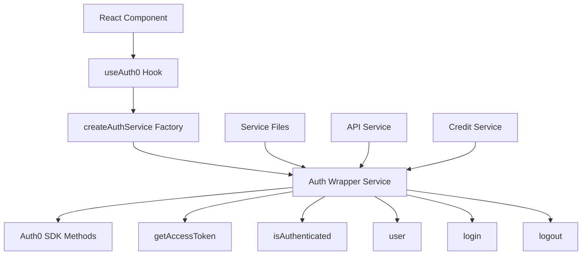

# Design Document: Auth Service Refactoring

## Overview

This design document outlines the refactoring approach for consolidating the duplicate authentication services (`authService.ts` and `authStateService.ts`) into a single, properly architected service that integrates correctly with the Auth0 SDK. The solution uses dependency injection to provide Auth0 context to service files while maintaining clean separation of concerns.

## Architecture

The refactored authentication system will follow a factory pattern with dependency injection:



### Key Design Principles:

1. **Single Responsibility** - One service handles all authentication concerns
2. **Dependency Injection** - Auth0 context is injected rather than directly accessed
3. **Proper Abstraction** - Service provides clean interface over Auth0 SDK
4. **No Direct Hook Usage** - Services receive configured instances, don't use hooks directly

## Components and Interfaces

### 1. Auth Service Factory

The factory function creates configured authentication service instances:

```typescript
export function createAuthService(auth0Context: ReturnType<typeof useAuth0>) {
  return {
    // Authentication status
    isAuthenticated: () => auth0Context.isAuthenticated,
    
    // Token management
    getAccessToken: async () => {
      if (!auth0Context.isAuthenticated) {
        return null;
      }
      try {
        return await auth0Context.getAccessTokenSilently();
      } catch (error) {
        console.error('Failed to get access token:', error);
        return null;
      }
    },
    
    // User information
    getUser: () => auth0Context.user,
    
    // Authentication actions
    login: (options?: LoginOptions) => auth0Context.loginWithRedirect(options),
    logout: (options?: LogoutOptions) => auth0Context.logout(options),
    
    // Guest user functionality (preserved from existing services)
    getRemainingGuestActions: () => UserActionService.getRemainingActions(),
    incrementGuestAction: (actionType = 'chat') => UserActionService.trackAction(actionType as any),
    isGuestLimitReached: () => UserActionService.getRemainingActions() <= 0,
    resetGuestActions: () => UserActionService.resetActions(),
    
    // Consent management (preserved from existing services)
    saveUserConsent: (consent: UserConsent) => ConsentService.saveConsent(consent),
    getUserConsent: () => ConsentService.getConsent(),
    
    // Navigation helpers (preserved from existing services)
    saveReturnPath: () => localStorage.setItem('auth_return_to', window.location.pathname),
    getReturnPath: () => localStorage.getItem('auth_return_to'),
    clearReturnPath: () => localStorage.removeItem('auth_return_to'),
  };
}

export type AuthServiceInstance = ReturnType<typeof createAuthService>;
```

### 2. Service Integration Pattern

Services that need authentication will receive the configured auth service:

```typescript
// API Service updated to use injected auth service
export class ApiService {
  constructor(private authService: AuthServiceInstance) {}
  
  private getAuthHeaders(): Record<string, string> {
    const headers: Record<string, string> = {
      'Content-Type': 'application/json',
    };
    
    if (this.authService.isAuthenticated()) {
      const token = await this.authService.getAccessToken();
      if (token) {
        headers['Authorization'] = `Bearer ${token}`;
      }
    }
    
    return headers;
  }
  
  // ... rest of API service methods
}

// Factory function for API service
export function createApiService(authService: AuthServiceInstance) {
  return new ApiService(authService);
}
```

### 3. Component Usage Pattern

React components will create and pass the auth service to other services:

```typescript
function MyComponent() {
  const auth0 = useAuth0();
  const authService = useMemo(() => createAuthService(auth0), [auth0]);
  const apiService = useMemo(() => createApiService(authService), [authService]);
  
  // Component logic using apiService
}
```

## Data Models

### Preserved Interfaces

All existing interfaces will be preserved to maintain compatibility:

```typescript
// From existing authService.ts
export interface UserProfile {
  sub: string;
  email?: string;
  phone_number?: string;
  name?: string;
  picture?: string;
  updated_at: string;
  marketingConsent?: boolean;
}

export interface UserConsent {
  termsAccepted: boolean;
  marketingConsent: boolean;
  timestamp: string;
}

export interface AuthState {
  isAuthenticated: boolean;
  token: string | null;
  expiresAt: number;
  user: UserProfile | null;
}
```

### New Service Configuration

```typescript
export interface AuthServiceConfig {
  auth0Context: ReturnType<typeof useAuth0>;
  enableGuestTracking?: boolean;
  enableConsentManagement?: boolean;
}

export interface LoginOptions {
  returnTo?: string;
  screen_hint?: 'signup' | 'login';
}

export interface LogoutOptions {
  returnTo?: string;
}
```

## Error Handling

### Authentication Errors

The service will provide consistent error handling:

```typescript
export class AuthError extends Error {
  constructor(
    message: string,
    public code: 'TOKEN_EXPIRED' | 'TOKEN_INVALID' | 'NOT_AUTHENTICATED' | 'NETWORK_ERROR',
    public originalError?: Error
  ) {
    super(message);
    this.name = 'AuthError';
  }
}

// Error handling in service methods
async getAccessToken(): Promise<string | null> {
  if (!this.auth0Context.isAuthenticated) {
    throw new AuthError('User not authenticated', 'NOT_AUTHENTICATED');
  }
  
  try {
    return await this.auth0Context.getAccessTokenSilently();
  } catch (error) {
    if (error.error === 'login_required') {
      throw new AuthError('Login required', 'TOKEN_EXPIRED', error);
    }
    throw new AuthError('Failed to get access token', 'NETWORK_ERROR', error);
  }
}
```

## Testing Strategy

### Unit Testing

1. **Service Factory Testing**
   - Test factory function with mocked Auth0 context
   - Verify all methods are properly bound
   - Test error handling scenarios

2. **Service Method Testing**
   - Mock Auth0 context responses
   - Test authentication state changes
   - Test token retrieval and error cases

### Integration Testing

1. **Service Integration**
   - Test API service with auth service
   - Test credit service with auth service
   - Verify proper token passing

2. **Component Integration**
   - Test component usage of factory pattern
   - Verify proper service instantiation
   - Test service updates on auth state changes

### Migration Testing

1. **Backward Compatibility**
   - Ensure all existing method signatures work
   - Test that existing tests pass without modification
   - Verify no functionality regression

## Implementation Considerations

### Migration Strategy

1. **Phase 1: Create New Service**
   - Implement `createAuthService` factory
   - Preserve all existing functionality
   - Add comprehensive tests

2. **Phase 2: Update Service Dependencies**
   - Update API service to use factory pattern
   - Update credit service to use factory pattern
   - Update other dependent services

3. **Phase 3: Update Components**
   - Update components to use factory pattern
   - Remove direct imports of old services
   - Update context providers if needed

4. **Phase 4: Remove Old Services**
   - Delete `authStateService.ts`
   - Clean up `authService.ts` (keep only types if needed)
   - Update all import statements

### Auth0 Integration Best Practices

1. **Token Management**
   - Always use `getAccessTokenSilently()` for tokens
   - Handle token refresh automatically through Auth0 SDK
   - Never manually store or retrieve tokens from localStorage

2. **Error Handling**
   - Properly handle Auth0 errors (login_required, consent_required, etc.)
   - Provide meaningful error messages to users
   - Implement proper retry logic for network errors

3. **Performance Optimization**
   - Cache auth service instances using useMemo
   - Avoid recreating services on every render
   - Use Auth0's built-in caching mechanisms

### Security Considerations

1. **Token Security**
   - Rely on Auth0's secure token storage
   - Never expose tokens in logs or error messages
   - Implement proper token validation on backend

2. **State Management**
   - Use Auth0's authentication state as source of truth
   - Avoid duplicating authentication state in application
   - Properly handle authentication state changes

### Backward Compatibility

1. **Method Signatures**
   - Preserve all existing public method signatures
   - Maintain same return types and error behaviors
   - Keep existing interfaces and types

2. **Functionality Preservation**
   - All guest user features continue to work
   - Consent management remains unchanged
   - Navigation helpers remain available

3. **Test Compatibility**
   - Existing tests should pass without modification
   - Mock interfaces remain the same
   - Test utilities continue to work

## File Structure

```
src/
├── services/
│   ├── auth/
│   │   ├── authService.ts          # New unified service factory
│   │   ├── authTypes.ts            # Type definitions
│   │   └── authErrors.ts           # Error classes
│   ├── api/
│   │   └── apiService.ts           # Updated to use auth service
│   ├── credit/
│   │   └── creditService.ts        # Updated to use auth service
│   └── __mocks__/
│       └── authService.ts          # Updated mocks
├── hooks/
│   └── useAuthService.ts           # Hook for creating auth service
└── types/
    └── auth.ts                     # Shared auth types
```

This structure provides clear separation of concerns while maintaining all existing functionality and ensuring proper Auth0 integration.