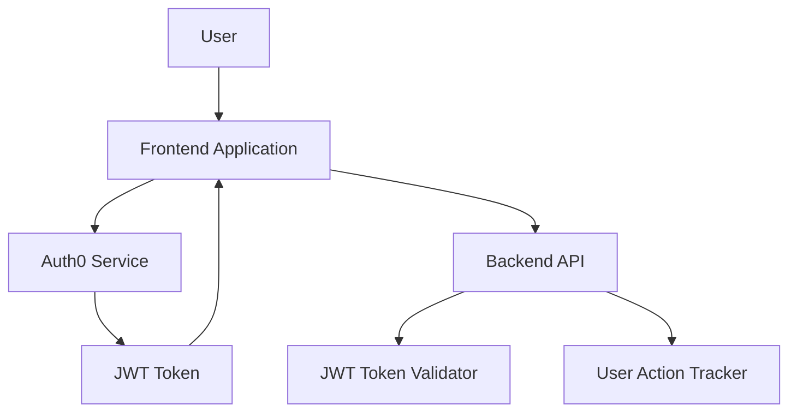

# Design Document: Auth0 Authentication and Guest Access Limits

## Overview

This design document outlines the implementation approach for integrating Auth0 authentication and guest access limitations in the AI Shopping Assistant application. The solution will distinguish between guest and registered users, limit guest usage to encourage sign-ups, and implement JWT validation for protected endpoints.

## Architecture

The authentication system will be integrated into the existing application architecture, with components added to both frontend and backend:



### Key Components:

1. **Auth0 Integration** - Handles user authentication through Auth0's Universal Login
2. **JWT Token Management** - Stores, refreshes, and validates JWT tokens
3. **User Action Tracker** - Counts and limits guest user actions
4. **UI State Manager** - Updates UI based on authentication state and usage limits

## Components and Interfaces

### 1. Frontend Components

#### Authentication Service

```typescript
interface AuthService {
  login(): Promise<void>;                   // Redirects to Auth0 login
  logout(): Promise<void>;                  // Logs out the user
  handleRedirect(): Promise<void>;          // Handles Auth0 redirect with token
  isAuthenticated(): boolean;               // Checks if user is authenticated
  getToken(): string | null;                // Gets the current token
  getUserInfo(): UserProfile | null;        // Gets user profile information
  getRemainingGuestActions(): number;       // Gets remaining message credits
}
```

#### Auth Context

```typescript
interface AuthContextType {
  isAuthenticated: boolean;                 // Authentication state
  isLoading: boolean;                       // Loading state during auth operations
  user: UserProfile | null;                 // User profile data
  remainingGuestActions: number;            // Remaining message credits for guest users
  login: () => Promise<void>;               // Login function
  logout: () => Promise<void>;              // Logout function
  decrementGuestActions: () => void;        // Decrements remaining message credits
}
```

#### UI Components

1. **LoginButton** - Triggers Auth0 login process
2. **UserProfileDisplay** - Shows user information when logged in
3. **GuestLimitIndicator** - Shows remaining actions for guest users
4. **LoginPromptModal** - Displayed when guest limit is reached

### 2. Backend Components

#### JWT Middleware

```typescript
interface JWTMiddleware {
  validateToken(token: string): boolean;    // Validates JWT token
  extractUserInfo(token: string): UserInfo; // Extracts user info from token
  handleAuthError(error: Error): Response;  // Handles authentication errors
}
```

#### User Action Tracking Service

```typescript
interface UserActionService {
  trackAction(userId: string, actionType: ActionType): Promise<boolean>;  // Tracks user action
  getRemainingActions(userId: string): Promise<number>;                  // Gets remaining actions
  isLimitReached(userId: string): Promise<boolean>;                      // Checks if limit is reached
}
```

## Data Models

### User Profile

```typescript
interface UserProfile {
  sub: string;                // Auth0 user ID
  email?: string;             // User email
  phone_number?: string;      // User phone number
  name?: string;              // User name
  picture?: string;           // User profile picture URL
  updated_at: string;         // Last update timestamp
  marketingConsent: boolean;  // Marketing consent flag
}
```

### Action Tracking

```typescript
interface UserAction {
  userId: string;             // User ID (anonymous for guests)
  actionType: ActionType;     // Type of action (CHAT, SEARCH)
  timestamp: Date;            // When the action occurred
}

enum ActionType {
  CHAT = 'chat',
  SEARCH = 'search'
}
```

### Authentication State

```typescript
interface AuthState {
  isAuthenticated: boolean;   // Whether user is authenticated
  token: string | null;       // JWT token
  expiresAt: number;          // Token expiration timestamp
  user: UserProfile | null;   // User profile information
}
```

## Error Handling

### Authentication Errors

1. **Token Validation Errors**
   - Invalid token format
   - Expired token
   - Invalid signature
   - Response: 401 Unauthorized with appropriate error message

2. **Auth0 Integration Errors**
   - Login failures
   - Redirect errors
   - Network issues
   - Response: Graceful error handling with retry options

### Guest Limit Errors

1. **Limit Exceeded Error**
   - Status: 403 Forbidden
   - Message: "Guest action limit reached. Please log in to continue."
   - UI: Display login prompt modal

## Testing Strategy

### Frontend Testing

1. **Unit Tests**
   - Auth service functions
   - Context provider state management
   - UI components conditional rendering

2. **Integration Tests**
   - Auth flow with mocked Auth0 responses
   - Guest limit enforcement
   - UI state transitions

3. **E2E Tests**
   - Complete authentication flow
   - Guest to authenticated user transition

### Backend Testing

1. **Unit Tests**
   - JWT validation functions
   - User action tracking logic

2. **Integration Tests**
   - API endpoints with authentication
   - Guest limit enforcement

3. **Security Tests**
   - Token validation robustness
   - Authentication bypass attempts

## Implementation Considerations

### Auth0 Configuration

1. **Application Setup**
   - Register application in Auth0 dashboard
   - Configure callback URLs
   - Set up appropriate connection types (email, phone)

2. **JWT Configuration**
   - Token lifetime settings
   - Signature algorithm (RS256 recommended)
   - Claims and scopes

### Local Storage Strategy

1. **Token Storage**
   - Store tokens in browser's localStorage or sessionStorage
   - Consider security implications and token refresh strategy

2. **Guest User Tracking**
   - Use localStorage to track guest user actions
   - Consider privacy implications and data retention policies

### API Security

1. **CORS Configuration**
   - Restrict API access to known origins
   - Implement proper CORS headers

2. **Rate Limiting**
   - Implement rate limiting for authentication attempts
   - Consider IP-based and user-based rate limiting

### User Experience

1. **Progressive Enhancement**
   - Application should work with limited functionality for users with JavaScript disabled
   - Graceful degradation for older browsers

2. **Accessibility**
   - Ensure authentication flows are accessible
   - Provide clear error messages and instructions

## Migration Strategy

1. **Phased Rollout**
   - Implement authentication infrastructure
   - Add guest user tracking
   - Enforce guest limitations
   - Enable full authentication requirements

2. **Existing Users**
   - Consider migration path for any existing users or data
   - Provide clear communication about new authentication requirements