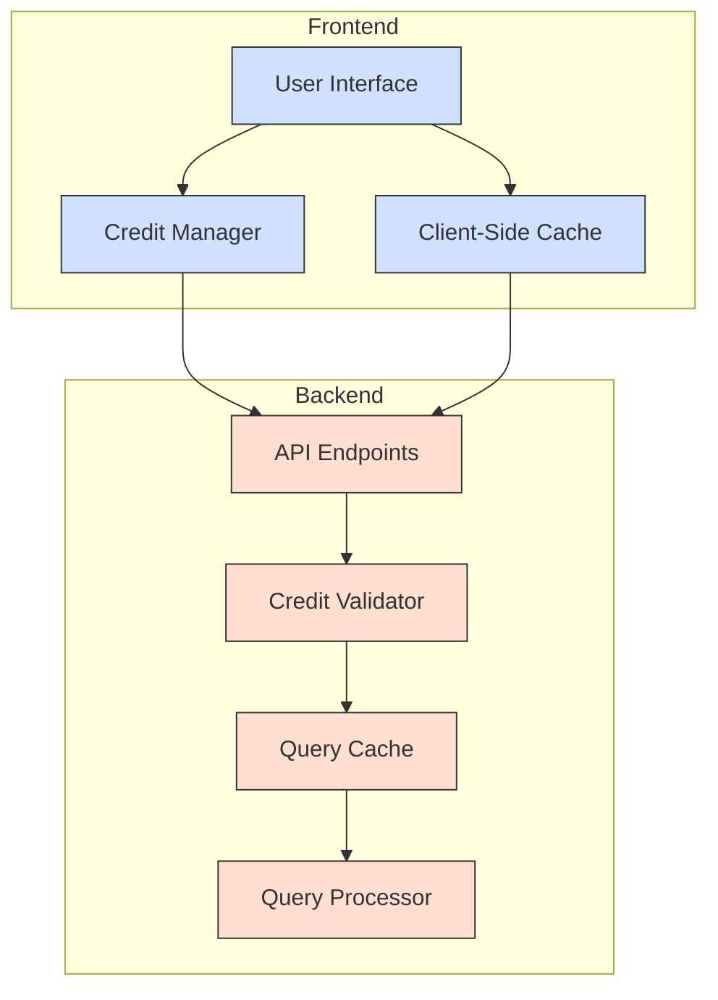

# Design Document: Message Credit System & Caching Optimization

## Overview

This design document outlines the implementation approach for replacing the current "Guest Actions" system with a "Message Credits" system and implementing both server-side and client-side caching mechanisms. The goal is to provide a clearer usage model for users while optimizing system resources through effective caching strategies.

The Message Credit System will differentiate between guest and registered users, with different credit allocations and reset policies. The caching mechanisms will reduce unnecessary API calls and improve response times by storing and reusing query results for configurable periods.

## Architecture

The implementation will follow a layered architecture approach:

1. **Presentation Layer**: Frontend components for displaying credit information and cached results
2. **Application Layer**: Services for credit management and caching logic
3. **Data Layer**: Storage mechanisms for credits and cached queries

### System Components Diagram



## Components and Interfaces

### Backend Components

#### 1. Credit Management Service

Responsible for tracking and managing user credits.

```python
class CreditManager:
    def get_user_credits(user_id: str) -> int:
        # Returns available credits for a user
        pass
        
    def deduct_credit(user_id: str) -> bool:
        # Deducts a credit from user's balance
        # Returns True if successful, False if insufficient credits
        pass
        
    def reset_credits(user_id: str = None) -> None:
        # Resets credits for a specific user or all users
        # Called by a scheduled job for registered users
        pass
```

#### 2. Query Cache Service

Handles server-side caching of query results.

```python
class QueryCache:
    def get_cached_result(query_hash: str) -> Optional[Dict]:
        # Returns cached result if exists and not expired
        pass
        
    def cache_result(query_hash: str, result: Dict) -> None:
        # Stores result with TTL based on configuration
        pass
        
    def generate_query_hash(query: str) -> str:
        # Creates a unique hash for the query string
        pass
```

#### 3. Credit Validator Middleware

Middleware to validate credit availability before processing requests.

```python
class CreditValidatorMiddleware:
    def __call__(self, request: Request) -> Response:
        # Validates user has sufficient credits
        # Returns error response if credits exhausted
        pass
```

### Frontend Components

#### 1. Credit Display Component

Shows user's available credits and related information.

```typescript
interface CreditDisplayProps {
  availableCredits: number;
  isGuest: boolean;
  maxCredits: number;
}

const CreditDisplay: React.FC<CreditDisplayProps> = ({ availableCredits, isGuest, maxCredits }) => {
  // Renders credit information and appropriate messages
};
```

#### 2. Client-Side Cache Manager

Manages local storage of query results.

```typescript
interface CacheManager {
  getCachedResult(query: string): Promise<QueryResult | null>;
  cacheResult(query: string, result: QueryResult): void;
  isCacheValid(timestamp: number): boolean;
  clearExpiredCache(): void;
}
```

#### 3. Query Input Component

Enhanced to handle cached results and credit limitations.

```typescript
interface QueryInputProps {
  onSubmit: (query: string) => void;
  availableCredits: number;
  cacheManager: CacheManager;
}

const QueryInput: React.FC<QueryInputProps> = ({ onSubmit, availableCredits, cacheManager }) => {
  // Handles query submission with cache checking
  // Disables input when credits exhausted
};
```

## Data Models

### Credit Model

```typescript
interface UserCredits {
  userId: string;
  isGuest: boolean;
  availableCredits: number;
  maxCredits: number;
  lastResetTimestamp: number;
}
```

### Cache Entry Model

```typescript
interface CacheEntry {
  queryHash: string;
  result: QueryResult;
  timestamp: number;
  expiresAt: number;
}
```

### Configuration Model

```typescript
interface CreditSystemConfig {
  MAX_GUEST_CREDITS: number;
  MAX_REGISTERED_CREDITS: number;
  CREDIT_RESET_INTERVAL_HOURS: number;
  CACHE_VALIDITY_MINUTES: number;
}
```

## Error Handling

1. **Credit Exhaustion**:
   - Frontend: Disable input with informative message
   - Backend: Return 403 Forbidden with clear error message

2. **Cache Failures**:
   - Graceful degradation to non-cached behavior
   - Log errors but continue processing request

3. **Configuration Issues**:
   - Use sensible defaults if configuration values are missing
   - Log warnings for misconfiguration

## Testing Strategy

### Unit Tests

1. **Credit Management**:
   - Test credit allocation for guest vs registered users
   - Test credit deduction logic
   - Test credit reset functionality

2. **Caching Mechanism**:
   - Test cache hit/miss scenarios
   - Test cache expiration logic
   - Test query hash generation

3. **Frontend Components**:
   - Test UI state with various credit levels
   - Test cached result display
   - Test input disabling when credits exhausted

### Integration Tests

1. **End-to-End Credit Flow**:
   - Test credit validation across frontend and backend
   - Test credit persistence across sessions

2. **Caching Integration**:
   - Test that cached results don't consume credits
   - Test cache indicators in UI
   - Test refresh functionality for cached results

### Performance Tests

1. **Cache Efficiency**:
   - Measure response time improvement with caching
   - Test system under load with and without caching

2. **Credit System Overhead**:
   - Measure any performance impact from credit tracking