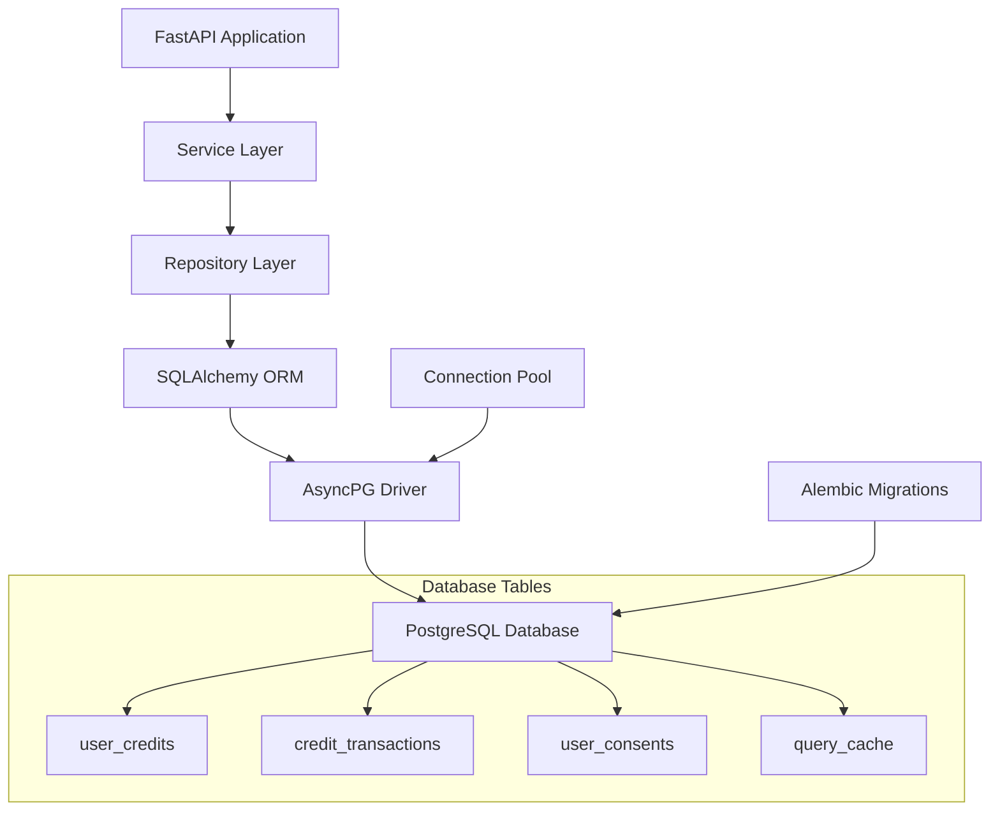

# Design Document

## Overview

This design outlines the migration from in-memory data storage to PostgreSQL for the AI Shopping Assistant backend. The migration will replace the current in-memory dictionaries and lists with persistent database storage while maintaining the existing service interfaces and API contracts.

The migration will use SQLAlchemy as the ORM with asyncpg as the PostgreSQL driver for optimal performance with FastAPI's async architecture. Database migrations will be handled using Alembic, and connection pooling will ensure efficient resource utilization.

## Architecture

### Database Layer Architecture



### Service Interface Preservation

The existing service classes (`CreditService`, `UserConsentService`, `QueryCacheService`) will maintain their current public interfaces. Internal implementation will be updated to use database repositories instead of in-memory storage.

## Components and Interfaces

### 1. Database Configuration

**New Configuration Class:**
```python
class DatabaseConfig(BaseModel):
    database_url: str
    pool_size: int = 10
    max_overflow: int = 20
    pool_timeout: int = 30
    pool_recycle: int = 3600
    echo_sql: bool = False
```

**Environment Variables:**
- `DATABASE_URL`: PostgreSQL connection string
- `DB_POOL_SIZE`: Connection pool size (default: 10)
- `DB_MAX_OVERFLOW`: Maximum overflow connections (default: 20)
- `DB_POOL_TIMEOUT`: Pool timeout in seconds (default: 30)
- `DB_ECHO_SQL`: Enable SQL query logging (default: False)

### 2. Database Models (SQLAlchemy)

**User Credits Table:**
```python
class UserCreditsDB(Base):
    __tablename__ = "user_credits"
    
    user_id: str = Column(String, primary_key=True)
    is_guest: bool = Column(Boolean, nullable=False)
    available_credits: int = Column(Integer, nullable=False)
    max_credits: int = Column(Integer, nullable=False)
    last_reset_timestamp: datetime = Column(DateTime(timezone=True), nullable=False)
    created_at: datetime = Column(DateTime(timezone=True), default=func.now())
    updated_at: datetime = Column(DateTime(timezone=True), default=func.now(), onupdate=func.now())
```

**Credit Transactions Table:**
```python
class CreditTransactionDB(Base):
    __tablename__ = "credit_transactions"
    
    id: int = Column(Integer, primary_key=True, autoincrement=True)
    user_id: str = Column(String, nullable=False, index=True)
    transaction_type: str = Column(String, nullable=False)
    amount: int = Column(Integer, nullable=False)
    timestamp: datetime = Column(DateTime(timezone=True), default=func.now())
    description: str = Column(Text, nullable=True)
```

**User Consents Table:**
```python
class UserConsentDB(Base):
    __tablename__ = "user_consents"
    
    user_id: str = Column(String, primary_key=True)
    terms_accepted: bool = Column(Boolean, nullable=False, default=True)
    marketing_consent: bool = Column(Boolean, nullable=False, default=False)
    timestamp: datetime = Column(DateTime(timezone=True), default=func.now())
    updated_at: datetime = Column(DateTime(timezone=True), default=func.now(), onupdate=func.now())
```

**Query Cache Table:**
```python
class QueryCacheDB(Base):
    __tablename__ = "query_cache"
    
    query_hash: str = Column(String, primary_key=True)
    result: dict = Column(JSON, nullable=False)
    cached_at: datetime = Column(DateTime(timezone=True), default=func.now())
    expires_at: datetime = Column(DateTime(timezone=True), nullable=False, index=True)
```

### 3. Repository Layer

**Base Repository:**
```python
class BaseRepository:
    def __init__(self, session: AsyncSession):
        self.session = session
    
    async def commit(self):
        await self.session.commit()
    
    async def rollback(self):
        await self.session.rollback()
```

**Credit Repository:**
```python
class CreditRepository(BaseRepository):
    async def get_user_credits(self, user_id: str) -> Optional[UserCreditsDB]
    async def create_user_credits(self, credits: UserCreditsDB) -> UserCreditsDB
    async def update_user_credits(self, user_id: str, **updates) -> Optional[UserCreditsDB]
    async def create_transaction(self, transaction: CreditTransactionDB) -> CreditTransactionDB
    async def get_user_transactions(self, user_id: str, limit: int) -> List[CreditTransactionDB]
    async def cleanup_old_transactions(self, days: int = 90) -> int
```

**Consent Repository:**
```python
class ConsentRepository(BaseRepository):
    async def get_consent(self, user_id: str) -> Optional[UserConsentDB]
    async def create_consent(self, consent: UserConsentDB) -> UserConsentDB
    async def update_consent(self, user_id: str, **updates) -> Optional[UserConsentDB]
    async def list_consents(self) -> List[UserConsentDB]
```

**Cache Repository:**
```python
class CacheRepository(BaseRepository):
    async def get_cached_result(self, query_hash: str) -> Optional[QueryCacheDB]
    async def cache_result(self, cache_entry: QueryCacheDB) -> QueryCacheDB
    async def cleanup_expired_cache(self) -> int
    async def clear_cache(self) -> None
```

### 4. Database Session Management

**Database Manager:**
```python
class DatabaseManager:
    def __init__(self, database_url: str, **kwargs):
        self.engine = create_async_engine(database_url, **kwargs)
        self.session_factory = async_sessionmaker(self.engine)
    
    async def get_session(self) -> AsyncSession:
        return self.session_factory()
    
    async def close(self):
        await self.engine.dispose()
```

**Dependency Injection:**
```python
async def get_db_session() -> AsyncGenerator[AsyncSession, None]:
    async with database_manager.get_session() as session:
        try:
            yield session
        except Exception:
            await session.rollback()
            raise
        finally:
            await session.close()
```

### 5. Migration System

**Alembic Configuration:**
- Migration scripts will be stored in `app/migrations/`
- Automatic migration running on application startup
- Version tracking in `alembic_version` table
- Support for rollback operations

**Migration Script Structure:**
```python
def upgrade():
    # Create tables with proper indexes and constraints
    pass

def downgrade():
    # Rollback changes safely
    pass
```

## Data Models

### Database Schema Design

**Indexes:**
- `user_credits.user_id` (Primary Key)
- `credit_transactions.user_id` (Index for user lookups)
- `credit_transactions.timestamp` (Index for time-based queries)
- `user_consents.user_id` (Primary Key)
- `query_cache.query_hash` (Primary Key)
- `query_cache.expires_at` (Index for cleanup operations)

**Constraints:**
- `user_credits.available_credits >= 0` (Check constraint)
- `user_credits.max_credits > 0` (Check constraint)
- `credit_transactions.amount != 0` (Check constraint)
- `query_cache.expires_at > cached_at` (Check constraint)

### Data Type Mappings

| Pydantic Model | PostgreSQL Type | Notes |
|----------------|-----------------|-------|
| `str` | `VARCHAR` | User IDs, transaction types |
| `int` | `INTEGER` | Credit amounts, limits |
| `bool` | `BOOLEAN` | Guest status, consent flags |
| `datetime` | `TIMESTAMP WITH TIME ZONE` | All timestamps |
| `dict` | `JSONB` | Cache results |
| `Optional[str]` | `TEXT` | Descriptions, nullable text |

## Error Handling

### Database Connection Errors

**Connection Pool Exhaustion:**
- Implement circuit breaker pattern
- Graceful degradation for non-critical operations
- Proper error logging and monitoring

**Connection Timeouts:**
- Retry logic with exponential backoff
- Maximum retry attempts configuration
- Fallback to read-only operations where possible

**Database Unavailability:**
- Health check endpoint integration
- Graceful application shutdown on persistent failures
- Clear error messages for debugging

### Transaction Management

**Deadlock Handling:**
- Automatic retry for deadlock errors
- Proper transaction isolation levels
- Timeout configuration for long-running transactions

**Constraint Violations:**
- Proper error mapping to business logic errors
- Validation before database operations
- Clear error messages for API responses

## Testing Strategy

### Unit Testing

**Repository Tests:**
- Mock database sessions using `pytest-asyncio`
- Test all CRUD operations
- Verify constraint handling
- Test error scenarios

**Service Tests:**
- Use in-memory SQLite for fast tests
- Test business logic with database integration
- Verify transaction rollback scenarios
- Test concurrent access patterns

### Integration Testing

**Database Integration:**
- Use test PostgreSQL database
- Test migration scripts
- Verify data consistency
- Test connection pool behavior

**End-to-End Testing:**
- Full application stack with test database
- API endpoint testing with database persistence
- Performance testing under load
- Failover and recovery testing

### Migration Testing

**Schema Migration Tests:**
- Test upgrade and downgrade operations
- Verify data preservation during migrations
- Test migration rollback scenarios
- Performance testing for large datasets

**Data Migration Tests:**
- Test existing in-memory data conversion
- Verify data integrity after migration
- Test partial migration scenarios
- Backup and restore procedures

## Performance Considerations

### Connection Pooling

- Initial pool size: 10 connections
- Maximum overflow: 20 connections
- Connection timeout: 30 seconds
- Connection recycling: 1 hour

### Query Optimization

**Indexing Strategy:**
- Primary keys for all tables
- Foreign key indexes where applicable
- Composite indexes for common query patterns
- Partial indexes for filtered queries

**Query Patterns:**
- Use prepared statements through SQLAlchemy
- Batch operations for bulk inserts/updates
- Pagination for large result sets
- Efficient cache cleanup queries

### Caching Strategy

**Application-Level Caching:**
- Keep frequently accessed data in memory
- Cache database connection metadata
- Use Redis for distributed caching if needed

**Database-Level Optimization:**
- Proper PostgreSQL configuration
- Regular VACUUM and ANALYZE operations
- Connection pooling at database level
- Read replicas for read-heavy operations

## Security Considerations

### Database Security

**Connection Security:**
- SSL/TLS encryption for database connections
- Connection string security (no hardcoded credentials)
- Database user with minimal required privileges
- Network-level access restrictions

**Data Protection:**
- No sensitive data in logs
- Proper handling of user consent data
- Data retention policies for transactions
- Secure backup and recovery procedures

### SQL Injection Prevention

- Use SQLAlchemy ORM for all database operations
- Parameterized queries only
- Input validation before database operations
- Regular security audits of database queries

## Deployment Strategy

### Migration Approach

**Phase 1: Database Setup**
1. Add PostgreSQL dependencies
2. Create database models and migrations
3. Set up connection pooling
4. Implement repository layer

**Phase 2: Service Migration**
1. Update services to use repositories
2. Maintain backward compatibility
3. Add comprehensive testing
4. Performance optimization

**Phase 3: Production Deployment**
1. Database provisioning
2. Migration script execution
3. Application deployment
4. Monitoring and validation

### Rollback Plan

**Database Rollback:**
- Alembic migration rollback scripts
- Database backup before migration
- Quick rollback procedures documented
- Data consistency verification

**Application Rollback:**
- Feature flags for database vs in-memory toggle
- Gradual rollout with monitoring
- Immediate rollback capability
- Data synchronization procedures